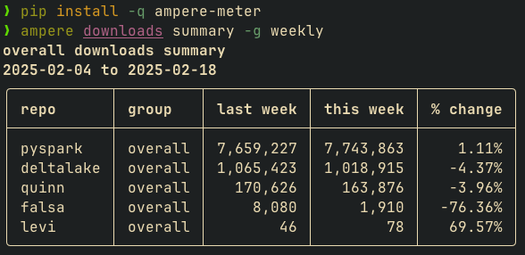
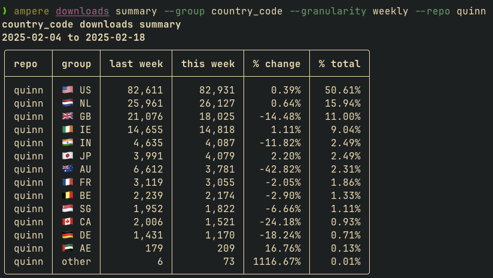
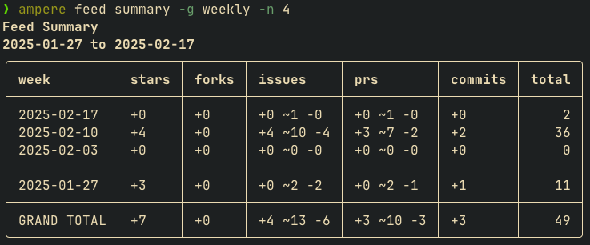
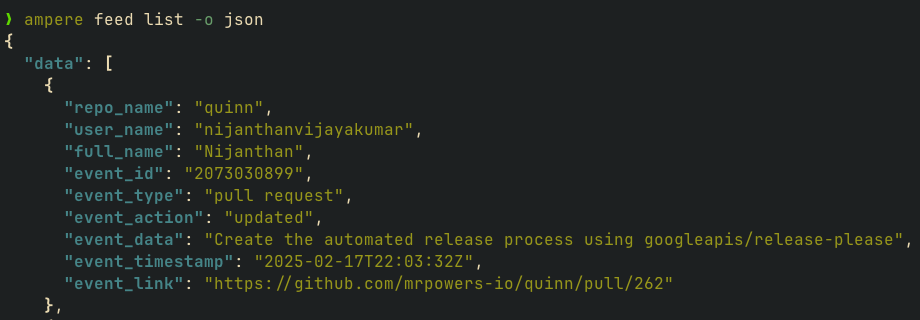

# [ampere](https://ampere.jeffbrennan.dev)

Tooling to track engagement with the [mrpowers-io](https://github.com/mrpowers-io) organization - available as a self-hosted dashboard and CLI

## Dashboard

## CLI

### downloads

### feed

## Installation

### CLI steps

#### pip

1. run `pip install ampere-meter`
2. see available cli commands via `ampere --help`

#### uv

1. create a virtual env via `uv venv`
2. add the package to the virtual env via `uv add ampere-meter`
3. see available cli commands via `uv run ampere --help` or `source .venv/bin/activate && ampere --help`

#### clone

1. clone the repo `git clone git@github.com:jeffbrennan/ampere.git`
2. cd into the directory `cd ampere`
3. install the CLI requirements `uv sync`
4. see available cli commands via `uv run ampere --help` or `source .venv/bin/activate && ampere --help`

#### homebrew

> [!WARNING]
the package is not bottled so this will build from source (might take a few minutes)

1. run `brew tap jeffbrennan/homebrew-ampere-meter && brew install ampere-meter`
2. see available cli commands via `ampere --help`

### [WIP] Dashboard steps

> [!WARNING]  
this is a work in progress and init scripts are not yet available

1. clone the repository
2. configure required environment variables in `.env` - refer to `.env.example`
3. run `uv sync --all-extras` to build the full .venv
4. `docker compose up --build` to start the api, backend, and frontend services

---

## API

documentation available at [https://api-ampere.jeffbrennan.dev/docs](https://api-ampere.jeffbrennan.dev/docs)

currently supports three endpoints:

1. `/repos` - list of current repos
2. `/feed` - recent github activity (stars, issues, prs, etc.)
3. `/downloads` - pypi download statistics (hourly, daily, weekly, monthly)

---

## Metrics

### Models

model definitions are available in the [models](./models/) directory

### Sources

#### [GitHub REST API](https://docs.github.com/en/rest)

updated 4 times a day

- repos
- stars
- issues
- commits
- forks
- releases
- pull requests

#### [Bigquery PyPi Downloads](https://console.cloud.google.com/marketplace/product/gcp-public-data-pypi)

updated daily

- python release downloads
grouped by package version, python version, operating system, cloud platform

additionally gets download statistics for core project dependencies

- pyspark
- deltalake

---

## Pages

### [home](https://ampere.jeffbrennan.dev)

Weekly github metrics

- stars
- issues
- commits

### [downloads](https://ampere.jeffbrennan.dev/downloads)

Weekly download statistics. Currently only includes python release downloads

- overall
- package version
- python version
- cloud platform

### [feed](https://ampere.jeffbrennan.dev/feed)

scrolling, color-coded table of recent organization activity

- stars
- issues
- commits
- forks
- pull requests

### [issues](https://ampere.jeffbrennan.dev/issues)

summary and details of current issues

- summary: open issues, median issue age, issues closed this month
- details: repo, author title, body, date, days old, comments

### [network stargazers](https://ampere.jeffbrennan.dev/network/network-stargazers)

each star is a node, and people who have starred multiple repositories are connected to each other
density of lines indicates common groups of stars
edges of each cluster indicate users who have only starred one repository

### [network followers](https://ampere.jeffbrennan.dev/network/network-followers)

each user is a node, internal (another organization user) followers and following are connected
includes any user with a record in one of these tables:

- stg_stargazers
- stg_forks
- stg_commits
- stg_issues
- stg_pull_requests

blue edges are a mutual connection, grey edges are one-way
color of node indicates number of followers

percentage of internal followers and following computed against user total followers and following

### [status](https://ampere.jeffbrennan.dev/status)

data quality page indicating the last time each data source was updated and the number of records in each table

### [about](https://ampere.jeffbrennan.dev/about)

repo summaries and links

---

## Tech Stack

This project is build with an open source (d)ata stack:

- [Dagster](https://github.com/dagster-io/dagster): data orchestration
- [Dash](https://github.com/plotly/dash): visualization
- [Delta](https://github.com/delta-io/delta): raw data storage
- [dbt](https://github.com/dbt-labs/dbt-core): data transformation
- [Docker](https://github.com/moby/moby): containerization
- [DuckDB](https://github.com/duckdb/duckdb): database

---

## TODOs

- [x] dark mode
- [x] page load speed
- [x] mobile improvements
- [x] create API
- [ ] create init scripts for first time setup
- [ ] add tests for API, CLI, and web application
- [x] and github actions to run tests, linting checks
- [x] publish to pypi
- [ ] add `ampere` to `mrpowers-io` organization
